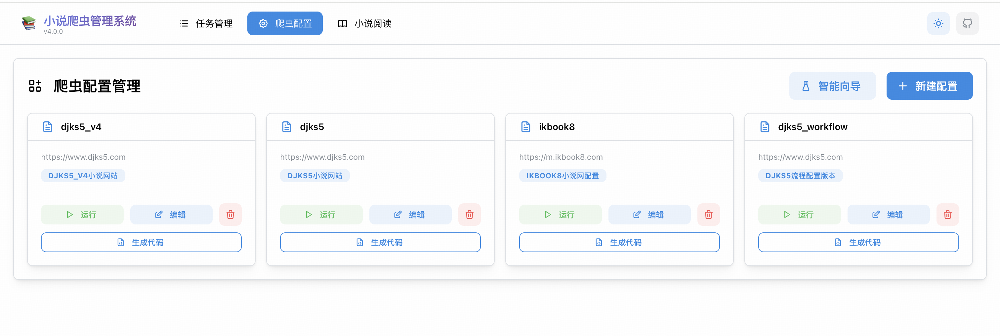
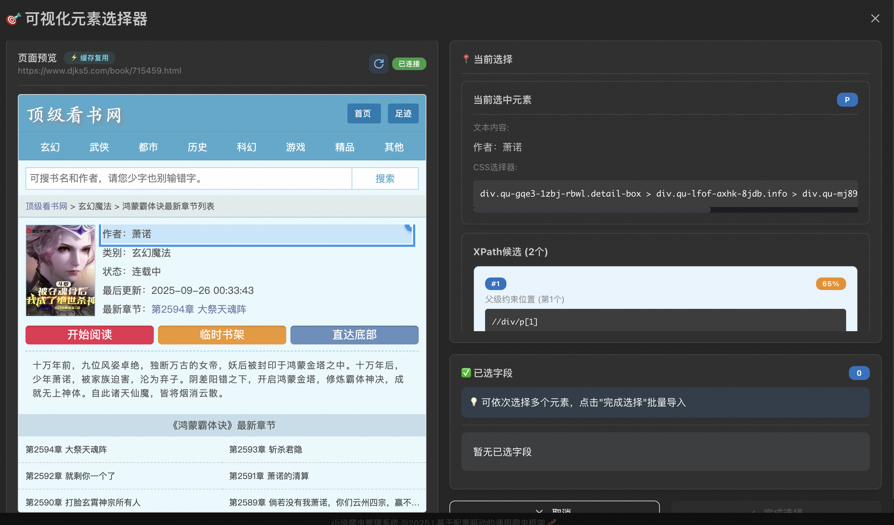
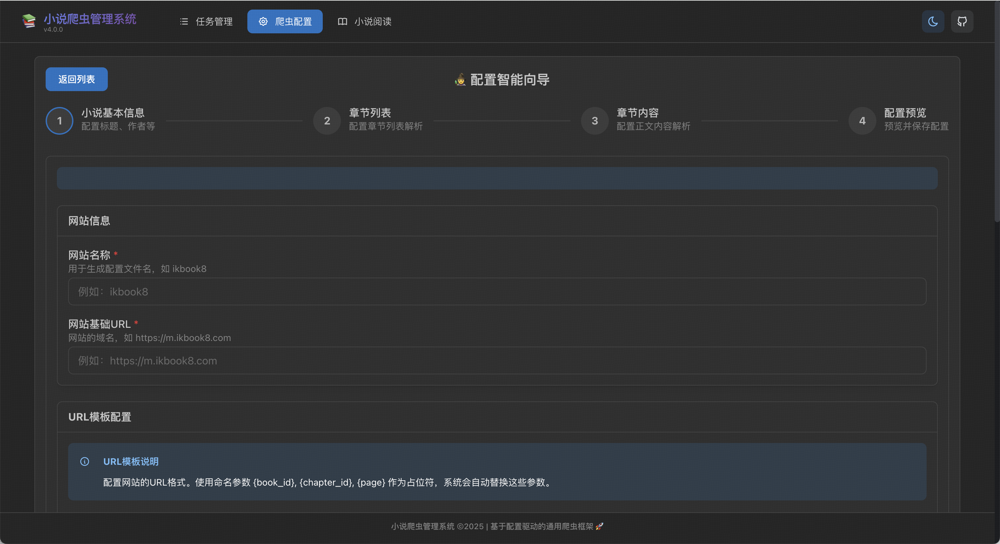
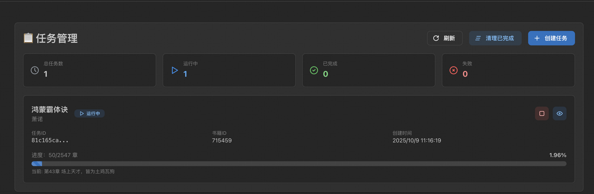
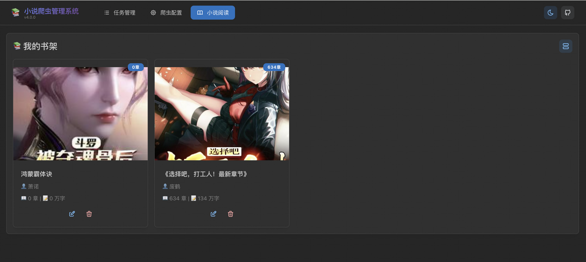
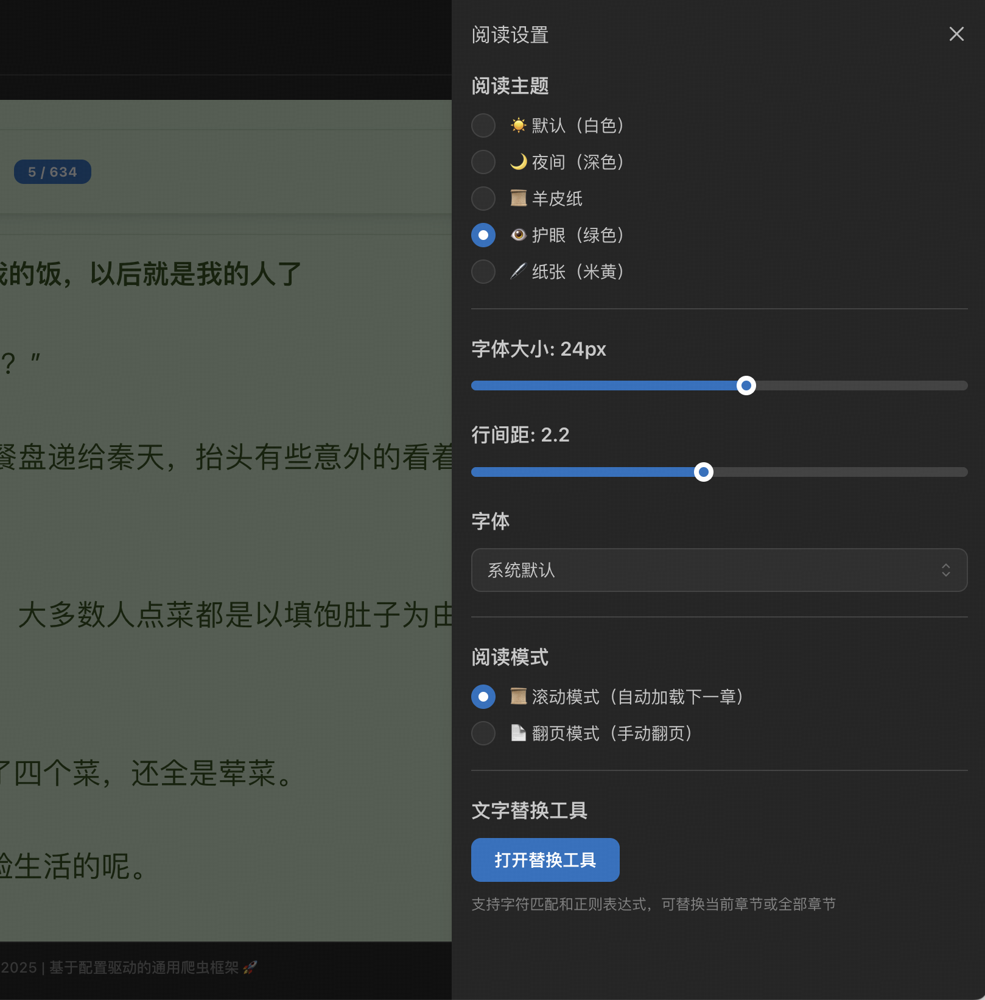

# 🚀 通用内容爬虫管理系统 v6.0.0

> 支持小说、新闻、文章、博客等多种内容类型的智能爬虫平台 | 配置驱动 + 可视化操作

[](https://www.python.org/)
[](https://flask.palletsprojects.com/)
[](https://reactjs.org/)
[](https://mantine.dev/)
[](LICENSE)

---

## 🎯 项目简介

这是一个**通用内容爬虫管理系统**，支持小说、新闻、文章、博客等多种内容类型的爬取与管理，将**配置化爬虫**、**任务管理**和**在线阅读**功能整合在一个平台中。

### ✨ 核心特点

- **🌐 多内容类型支持** - 支持小说、新闻、文章、博客等，自动适配字段名称
- **🎯 可视化元素选择器** - 在真实页面上点击元素，自动生成智能XPath，效率提升6-9倍！
- **🤖 智能XPath生成** - 7种生成策略，置信度高达98%
- **🎨 可视化流程编辑器** - 零代码拖拽式配置爬虫规则
- **🔌 插件化架构** - 灵活的清洗规则插件系统
- **📡 实时进度追踪** - WebSocket实时推送爬虫进度和日志
- **📖 在线阅读体验** - 现代化阅读界面，支持多种主题和阅读模式

---

## 📸 功能预览

<table>
  <tr>
    <td width="50%">
      
      <p align="center"><em>爬虫配置管理（明暗主题）</em></p>
    </td>
    <td width="50%">
      
      <p align="center"><em>可视化元素选择器 ⭐</em></p>
    </td>
  </tr>
  <tr>
    <td width="50%">
      
      <p align="center"><em>智能配置向导</em></p>
    </td>
    <td width="50%">
      
      <p align="center"><em>实时任务管理</em></p>
    </td>
  </tr>
  <tr>
    <td width="50%">
      
      <p align="center"><em>现代化书架界面</em></p>
    </td>
    <td width="50%">
      
      <p align="center"><em>沉浸式阅读体验</em></p>
    </td>
  </tr>
</table>

---

## 🚀 快速开始

### Linux / macOS（推荐）

```bash
# 1. 克隆项目
git clone git@github.com:cxapython/noval.git
cd noval

# 2. 一键启动（首次运行会自动安装所有依赖）
./start.sh

# 就这么简单！脚本会自动完成所有配置和依赖安装
```

**首次运行**: 5-10分钟 | **后续启动**: 5-10秒

### Windows

```batch
# 1. 克隆项目
git clone git@github.com:cxapython/noval.git
cd noval

# 2. 安装依赖
pip install -r requirements.txt
cd frontend && npm install && cd ..

# 3. 一键启动
start.bat
```

### 访问应用

- 🌐 **前端界面**: http://localhost:3000
- 🔧 **后端API**: http://localhost:5001

---

## 📚 完整文档

> 所有详细文档已整理到 `docs/` 目录

### 🚀 新手入门

- **[安装指南](docs/getting-started/installation.md)** - 详细的安装步骤和环境配置
- **[快速开始](docs/getting-started/quick-start.md)** - 5分钟快速上手教程
- **[系统要求](docs/getting-started/system-requirements.md)** - 运行环境要求

### ✨ 功能文档

- **[可视化元素选择器](docs/features/visual-selector.md)** ⭐ - 最强大的配置方式！点击元素自动生成XPath
- **[可视化流程编辑器](docs/features/flow-editor.md)** - 零代码拖拽式配置，插件化架构
- **[爬虫配置管理](docs/features/crawler-manager.md)** - 配置文件管理和编辑
- **[智能配置向导](docs/features/config-wizard.md)** - 向导式配置流程
- **[任务管理系统](docs/features/task-manager.md)** - 实时追踪爬虫进度
- **[小说阅读器](docs/features/novel-reader.md)** - 现代化阅读体验

### 📘 用户指南

- **[使用示例](docs/user-guides/usage-examples.md)** - 完整的实战案例
- **[快捷键参考](docs/user-guides/shortcuts.md)** - 所有快捷键说明
- **[常用命令](docs/user-guides/common-commands.md)** - 服务管理和维护命令

### 🔧 技术文档

- **[系统架构](docs/technical/architecture.md)** - 整体架构设计
- **[技术栈](docs/technical/tech-stack.md)** - 前后端技术选型
- **[项目结构](docs/technical/project-structure.md)** - 目录结构说明

### ❓ 其他资源

- **[常见问题 (FAQ)](docs/faq/faq.md)** - 问题排查和解决方案
- **[版本历史](docs/changelog/changelog.md)** - 完整的更新记录
- **[文档中心](docs/README.md)** - 所有文档的导航索引

---

## ⌨️ 快捷键速查

### 可视化元素选择器

| 快捷键 | 功能 |
|-------|------|
| `↑` | 向上选择父元素 |
| `↓` | 向下选择子元素 |
| `Space` | 测试XPath |
| `Enter` | 确认添加字段 |
| `1-9` | 快速选择XPath候选 |

### 阅读器

| 快捷键 | 功能 |
|-------|------|
| `← →` | 翻页 |
| `Ctrl+F` | 搜索 |
| `T` | 目录 |
| `S` | 设置 |

[查看完整快捷键列表](docs/user-guides/shortcuts.md)

---

## 🎯 推荐使用流程

### 1. 创建配置（3分钟）⭐

**使用可视化元素选择器**：
```
访问 http://localhost:3000/crawler
→ 新建配置
→ 输入URL并渲染
→ 点击页面元素
→ 自动生成XPath
→ 批量导入字段
→ 保存配置
```

### 2. 运行爬虫（实时监控）

**使用任务管理器**：
```
访问 http://localhost:3000/tasks
→ 选择配置
→ 输入ID
→ 开始爬取
→ 实时查看进度
```

### 3. 在线阅读（沉浸体验）

```
访问 http://localhost:3000/reader
→ 选择小说
→ 选择主题
→ 开始阅读
```

---

## 📊 技术栈

### 前端
- React 18 + Mantine 7 - 现代化UI
- React Flow 11 - 流程图编辑
- Monaco Editor - 代码编辑
- Axios + Socket.IO - 网络通信

### 后端
- Flask 3.0 + SQLAlchemy 2.0 - Web框架
- Playwright - 浏览器自动化
- Loguru - 日志管理
- MySQL + Redis - 数据存储

[查看完整技术栈](docs/technical/tech-stack.md)

---

## 🔄 版本信息

### 当前版本: v6.0.0 (2025-10-14)

**重大更新**：
- ✅ 多内容类型支持（小说/新闻/文章/博客）
- ✅ 智能字段映射系统
- ✅ 全新UI设计（渐变主题、彩色卡片）
- ✅ 深色模式优化
- ✅ 完全向后兼容

[查看完整版本历史](docs/changelog/changelog.md)

---

## 🛠️ 常用命令

```bash
# 启动服务
./start.sh                    # Linux/macOS
start.bat                     # Windows

# 停止服务
./stop.sh                     # Linux/macOS
stop.bat                      # Windows

# 查看日志
tail -f logs/backend.log      # 后端日志
tail -f logs/frontend.log     # 前端日志

# 备份数据
mysqldump -u root -p novel_db > backup.sql

# 初始化数据库
python3 scripts/init_reader_tables.py
python3 scripts/init_auth_tables.py
```

[查看更多命令](docs/user-guides/common-commands.md)

---

## 🐛 故障排查

### 常见问题

| 问题 | 解决方案 |
|-----|---------|
| 端口被占用 | `lsof -ti:5001 \| xargs kill -9` |
| 依赖安装失败 | 使用国内镜像源 |
| 数据库连接失败 | 检查MySQL服务状态 |
| 页面渲染失败 | 检查Playwright安装 |

[查看完整FAQ](docs/faq/faq.md)

---

## 📁 项目结构

```
noval/
├── backend/          # 后端代码（Flask + 爬虫引擎）
├── frontend/         # 前端代码（React + Mantine）
├── shared/           # 共享模块（数据模型 + 工具类）
├── configs/          # 爬虫配置文件
├── scripts/          # 工具脚本
├── tests/            # 测试文件
├── docs/             # 📚 完整文档
├── logs/             # 日志文件
├── start.sh          # 启动脚本
└── README.md         # 本文件
```

[查看详细项目结构](docs/technical/project-structure.md)

---

## 🎓 学习路径

### 新手（第1天）
1. [安装指南](docs/getting-started/installation.md) - 安装系统
2. [快速开始](docs/getting-started/quick-start.md) - 第一个爬虫
3. [可视化选择器](docs/features/visual-selector.md) - 最简单的配置方式

### 进阶（第2-7天）
1. [流程编辑器](docs/features/flow-editor.md) - 零代码配置
2. [使用示例](docs/user-guides/usage-examples.md) - 实战案例
3. [快捷键](docs/user-guides/shortcuts.md) - 提升效率

### 高级（持续学习）
1. [系统架构](docs/technical/architecture.md) - 理解设计
2. [技术栈](docs/technical/tech-stack.md) - 技术选型
3. [项目结构](docs/technical/project-structure.md) - 深入源码

---

## 🤝 贡献指南

欢迎贡献代码、报告问题或提出建议！

1. Fork 本仓库
2. 创建特性分支 (`git checkout -b feature/AmazingFeature`)
3. 提交更改 (`git commit -m 'Add some AmazingFeature'`)
4. 推送到分支 (`git push origin feature/AmazingFeature`)
5. 开启 Pull Request

---

## 📄 许可证

本项目采用 MIT 许可证 - 详见 [LICENSE](LICENSE) 文件

---

## 🙏 致谢

感谢所有开源项目的贡献者！

特别感谢：
- [Mantine](https://mantine.dev/) - 现代化 React UI 组件库
- [React Flow](https://reactflow.dev/) - 强大的流程图库
- [Playwright](https://playwright.dev/) - 浏览器自动化工具
- [Flask](https://flask.palletsprojects.com/) - 轻量级Web框架

---

## 📞 获取帮助

- **📖 查看文档**: [docs/README.md](docs/README.md)
- **🐛 报告问题**: [GitHub Issues](https://github.com/cxapython/noval/issues)
- **💬 讨论交流**: [GitHub Discussions](https://github.com/cxapython/noval/discussions)

---

## 🌟 Star History

如果这个项目对你有帮助，请给一个 ⭐️ Star！

---

<p align="center">
  <strong>开始使用：</strong>
  <code>./start.sh</code>
  <br><br>
  <strong>然后访问：</strong>
  <a href="http://localhost:3000">http://localhost:3000</a>
  <br><br>
  <em>让爬虫配置变得简单、高效、愉悦 ✨</em>
</p>

---

**项目维护**: 保持简单、高效、易用 | **最新版本**: v6.0.0 | **文档**: [docs/](docs/)
